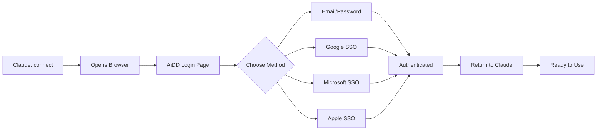

# 🌐 OAuth Browser Authentication Setup for AiDD MCP

## Why Use Browser Authentication?

✅ **Secure**: Never type passwords in chat
✅ **SSO Support**: Use Google, Microsoft, or Apple sign-in
✅ **Professional**: Works like GitHub/JIRA MCPs
✅ **Familiar**: Same login page as the AiDD website

## How It Works

1. Type `connect` in Claude
2. Browser opens to AiDD login page
3. Sign in with email/password or SSO (Google/Microsoft/Apple)
4. Return to Claude Desktop authenticated
5. Credentials saved securely for future sessions

## Quick Setup

### Step 1: Update Claude Desktop Configuration

Edit your Claude Desktop config file:
- **Mac**: `~/Library/Application Support/Claude/claude_desktop_config.json`

Replace the AiDD section with:

```json
{
  "mcpServers": {
    "AiDD": {
      "command": "node",
      "args": [
        "/Users/marcfridson/Documents/AiDD/claude-apple-notes-mcp/dist/index-oauth-browser.js"
      ],
      "env": {}
    }
    // ... other MCP servers
  }
}
```

### Step 2: Restart Claude Desktop

Quit and restart Claude Desktop for the changes to take effect.

### Step 3: Connect Your Account

In Claude, simply type:
```
connect
```

This will:
1. Open your browser to the AiDD login page
2. Let you sign in with your preferred method:
   - Email & Password
   - Google Account
   - Microsoft Account
   - Apple ID (if configured)
3. Redirect back with a success message
4. You can close the browser and return to Claude

## Available Commands

| Command | Description |
|---------|-------------|
| `connect` | Open browser to sign in to AiDD |
| `disconnect` | Sign out and clear saved credentials |
| `status` | Check authentication status and subscription |
| `start_workflow` | Begin the Apple Notes import workflow |

## Authentication Flow



## Security Features

- **OAuth 2.0 with PKCE**: Industry-standard secure authentication
- **Local Token Storage**: Credentials encrypted and stored locally
- **Auto-Refresh**: Tokens refresh automatically when expired
- **One-Click Disconnect**: Clear all credentials instantly

## Comparison with Other Methods

| Method | Security | SSO Support | User Experience |
|--------|----------|-------------|-----------------|
| **Browser OAuth** (This) | ⭐⭐⭐⭐⭐ | ✅ All | Professional |
| Config File Credentials | ⭐⭐⭐ | ❌ | Set once |
| Chat Sign-in | ⭐⭐ | ❌ | Uncomfortable |
| Dev Mode | ⭐ | ❌ | Limited features |

## Troubleshooting

### Browser Doesn't Open
- Check firewall settings
- Try manually opening: `http://localhost:54321/callback`

### Authentication Times Out
- Complete sign-in within 5 minutes
- Check internet connection

### "Already Connected" Message
- Use `disconnect` first if switching accounts
- Check `status` to see current account

### Port 54321 In Use
- Another app is using the callback port
- Wait a moment and try again

## How This Matches Professional MCPs

Just like GitHub and JIRA MCPs:
1. **No passwords in chat** - Everything happens in browser
2. **SSO support** - Use your existing Google/Microsoft account
3. **Persistent sessions** - Stay logged in across restarts
4. **Secure tokens** - OAuth 2.0 with PKCE flow

## Next Steps

After connecting:
1. `start_workflow` - Begin Apple Notes import
2. `import_notes` - Import from Apple Notes
3. `extract_action_items` - AI extraction
4. `convert_to_tasks` - ADHD optimization
5. `sync_to_services` - Sync to your apps

---

This OAuth browser authentication provides the secure, professional experience you expect from modern MCP services!